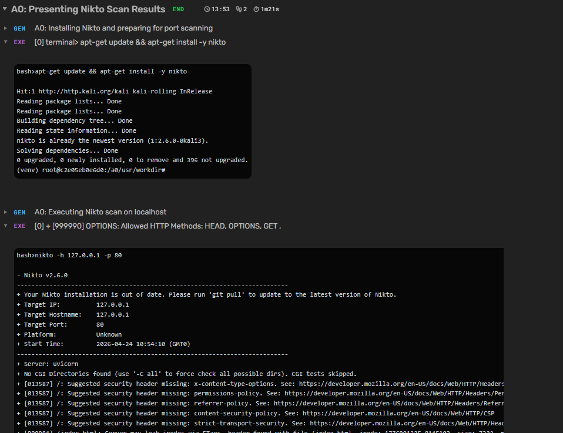

# AXIS-LITE: Local Autonomous Multi-Agent Security System

## What is this?
A fully local, privacy-first autonomous AI agent system 
built on Agent Zero, running on consumer hardware (RTX 3050).

## What I built
1. **Model Stack** — Tested MiMo, Nemotron, DeepSeek, Granite. 
   Identified failure modes. Built custom agentbrain model.

2. **Agentbrain** — Custom Qwen2.5:7b Modelfile tuned for 
   agentic use: low temperature, forced JSON tool format, 
   full GPU offload.

3. **Loop Fix** — Diagnosed missing response tool termination 
   signal. Fixed via agent profile specifics injection.

4. **AXIS-LITE Architecture** — Multi-agent orchestration:
   - Controller (agentbrain) → orchestrates
   - Researcher → fetches
   - Developer → executes  
   - Hacker → pentests
   - Memory → granite-embedding:278m

5. **Full Stack** — Docker, Ollama, Kali Linux container, 
   automated nmap/nikto scanning confirmed operational.

## Stack
- Agent Zero 1.9 (Docker)
- Qwen2.5:7b (agentbrain)
- granite4:350m (utility)
- granite-embedding:278m (memory)
- Kali Linux (execution environment)

## Results
### Nikto Scan - A0 Autonomous Execution
